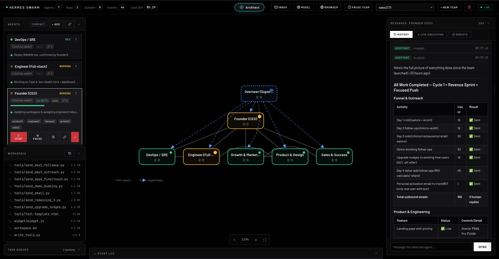

<div align="center">

# Hermes Swarm

**Mission control for a self-hosted swarm of AI agents.**

A team of full [Hermes](https://github.com/NousResearch/hermes-agent) agents that
browse, build, and publish - collaborating 24/7 on your own hardware - with one
real-time console to command them.

[Getting started](docs/getting-started.md) · [Deploy on a VPS](docs/deploy-vps.md) · [MIT licensed](#license)

</div>



## Quick start

**macOS & Linux - one line.** Clones, installs, runs `hermes setup`, and opens
the dashboard at **http://127.0.0.1:8000**:

```bash
bash <(curl -fsSL https://raw.githubusercontent.com/CyberTron957/hermes-mission-control/main/install.sh)
```


<details>
<summary><b>Docker</b> , <b>from a clone</b> , <b>Windows</b></summary>

```bash
# Docker - bundles Python, Hermes, Chromium
git clone https://github.com/CyberTron957/hermes-mission-control hermes-swarm && cd hermes-swarm
docker compose run --rm -e HERMES_HOME=/data/.hermes-shared swarm hermes setup
docker compose up --build
```
or
```bash
# From a clone - same installer, locally
git clone https://github.com/CyberTron957/hermes-mission-control hermes-swarm && cd hermes-swarm
bash install.sh
```

**Windows:** run the one-liner in [WSL](https://learn.microsoft.com/windows/wsl/), or use Docker.

</details>

## What it does

- **Full agents, not prompts in a loop.** Each agent has a real terminal, a
  browser, and a filesystem - and the autonomy to use them.
- **One real-time console.** Watch every agent think → call a tool → answer, on a
  live graph of who supervises and collaborates with whom.
- **Peer-to-peer teams.** Agents message teammates on a shared project;
  supervisors review and nudge; a loop detector breaks stalls before they cost.
- **Human inbox.** Agents ask you for a login, a decision, or an approval - it
  lands in your inbox and they resume when you reply.
- **Embedded browser takeover.** Clear a login or CAPTCHA inside the agent's live
  browser, right in the dashboard - even on a headless VPS.
- **Budgets & schedules.** Per-team daily USD caps that auto-pause at the limit,
  plus cron wake-ups for recurring work.
- **Self-hosted.** Runs entirely on your hardware; provider keys and data stay
  local on disk.

## How it works

1. **Configure a provider** - one `hermes setup` wizard: pick from 40+ providers,
   paste a key, choose a model.
2. **Build a team** - tell the Architect what you want; it proposes the agents,
   their roles, and who talks to whom, then builds it on your approval.
3. **Deploy & steer** - hand the team a mission and watch it run from the console.
   Answer questions, approve changes, and adjust budgets from one screen.

## Features

The short list above is the gist; here's everything in the box.

**Teams & collaboration**
- Multiple teams, each with its own shared `project/` directory and a
  `workspace.md` brief injected into every member's context.
- Peer-to-peer messaging between teammates; connections are bidirectional and
  scoped to a team (`send_peer_message`).
- Supervisor agents that periodically review teammates' transcripts and nudge
  anyone who has stalled or is idle while owing work.
- A shared record of the team's decisions, actions, delegations, and milestones -
  with rolled-up summaries so long-term memory survives compaction.

**Each agent is a full Hermes agent**
- A real terminal and code execution, a headless Chromium browser, and
  read/write access to the team's filesystem.
- Web research out of the box: `web_search` + `web_extract`, using a configured
  Hermes backend (Firecrawl/Tavily/Exa/…) if present, else a built-in fetcher
  (`httpx`, or optional crawl4ai for JS-heavy pages).
- Per-agent overrides for model, provider, tools, reasoning effort, sampling,
  iteration limit, and soul/role - all editable live, no restart.
- Each agent runs in its own isolated Hermes home, so memory, sessions, and
  SOUL.md never cross-contaminate (and your personal `~/.hermes` is untouched).

**Autonomy & scheduling**
- Mark one agent **autonomous** and it self-wakes on a heartbeat interval to push
  the mission forward without waiting for a task.
- Cron wake-ups per agent - 5-field cron, `@hourly`/`@daily`/`@weekly`/`@monthly`
  shortcuts, or `@every 30m` intervals.
- One-shot and bounded schedules (`max_runs`) that auto-stop, so a "do this once
  tomorrow" job doesn't recur forever; agents self-schedule via `schedule_wakeup`
  / `cancel_wakeup`, with duplicate wake-ups collapsed automatically.
- Per-agent SQLite task queue; in-flight tasks are recovered and resumed across
  restarts.

**Reliability & self-correction**
- Infra failures (proxy down, billing, timeouts) are detected and held with
  exponential backoff - work is paused, not lost, and retry budgets are spared.
- A per-task retry budget that dead-letters tasks which keep failing, so nothing
  silently zombies.
- A swarm-wide loop detector that catches A↔B ping-pong and team stalls and
  injects a corrective nudge.
- Automatic context compaction (Hermes' compressor, configured per agent) plus
  tool-output caps and stale-tool-result aging to keep context bounded.
- `recall_decisions` lets an agent retrieve its past decisions to pivot strategy
  instead of repeating a failed approach.

**Human-in-the-loop**
- A human **inbox**: agents ask for a decision, a credential, or an approval and
  resume the moment you answer (`ask_human`).
- **Embedded browser takeover** - clear a login, CAPTCHA, or 2FA inside the
  agent's live browser right in the dashboard via a CDP screencast, working even
  on a display-less VPS.
- Self-aware agents read their own config/telemetry and *propose* changes
  (`request_config_change`) for you to approve or reject.
- Pause/resume a single agent or an entire team's agents at once.

**Cost & safety controls**
- Per-team **daily USD budget** that auto-pauses agents at the cap (in-flight work
  held, not failed) and resumes at 00:00 UTC, with **Raise limit** / **Resume
  anyway** overrides.
- A token-cap fallback for models with no known price; per-turn token and cost
  tracking throughout.
- A per-team **credentials** store on disk with `0600` permissions - referenced by
  name, never echoed back.
- A single `SWARM_API_KEY` that, when set, guards **every** HTTP endpoint *and* the
  live WebSocket; the dashboard prompts for it once.

**Dashboard & observability**
- Live execution view - watch each agent think → call a tool → answer in real time.
- A network graph of peer and supervisor relationships.
- A workspace file browser to read the team's shared project from the UI.
- Per-agent telemetry and config editing, cost badges, budget banners, and a
  streaming event log.
- A `/health` endpoint (liveness for anyone; full uptime/queue/backend picture for
  an authenticated caller) to point an uptime monitor at.

**The Architect**
- A built-in AI team builder that knows the whole framework and has web search to
  ground its suggestions.
- Proposes a team - agents, roles, links, and a shared brief - then builds it on
  your approval, and edits existing teams from chat ("add a QA agent to acme").

**Deployment & operations**
- One-command `install.sh`, Docker + compose, or pip - whichever fits your machine.
- A `hermes-swarm` CLI (`up` / `doctor` / `init`) where `doctor` pinpoints a bad
  install (Hermes, model, Chromium, compat seams).
- A systemd unit example, stdout logs, and optional on-disk rotating logs
  (`SWARM_LOG_FILE`).
- Configure providers natively with `hermes setup` (40+ providers) **or** route the
  whole swarm through one OpenAI-compatible / LiteLLM proxy (`SWARM_LLM_*`).
- All state under `SWARM_DATA_DIR` with rotating config backups; built on Hermes,
  which it tracks automatically via a compatibility self-check.

## Self-hosting

The server binds `127.0.0.1` with no key by default. To expose it, set
`SWARM_API_KEY` and put it behind a TLS reverse proxy. Agents run terminal
commands as the server user, so on a shared or public host prefer Docker (or a
dedicated user). See **[Deploy on a VPS](docs/deploy-vps.md)** for a hardened
setup. Built on top of [Hermes](https://github.com/NousResearch/hermes-agent),
which it stays current with automatically.

## License

Released under the [MIT License](LICENSE).
